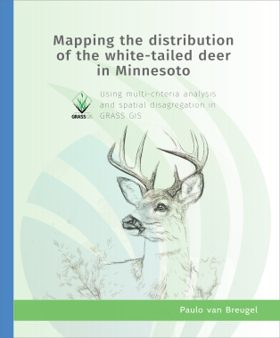

# Mapping the distribution of the White-tailed deer in Minnesota, using multi-criteria analysis and spatial disagregation in GRASS GIS

This tutorial is designed as a practical introduction to using GRASS GIS for suitability mapping of a species based on a multi-criteria analysis (MCA) approach. It uses the distribution of white-tailed deer as a case study. The tutorial aims to provide an accessible way to learn the principles of spatial analysis and decision-making workflows within GRASS GIS.

Through a structured, hands-on approach, you will learn how to use GRASS GIS to integrate various spatial data layers, apply multi-criteria analysis techniques, and generate meaningful insights about deer distribution patterns. While the white-tailed deer serves as the focal species, the skills and concepts presented are widely applicable to a range of ecological and spatial decision-making scenarios.

This tutorial emphasizes learning by doing, guiding you through the core functionality of GRASS GIS, including data import, preprocessing, and advanced spatial modeling. As an open-source platform, GRASS GIS provides a powerful and flexible environment for ecological analysis, making it an ideal tool for MCA. By the end of this tutorial, you will have a understanding of how to use GRASS GIS for MCA and the confidence to apply these techniques to your own projects.

The repository contains the source material (Quarto book), but note that the Quarto extensions are not included. They need to be installed separately. 

For the latest online HTML version, go to [https://ecodiv.earth/TutorialsNotes/deerdensities/](https://ecodiv.earth/TutorialsNotes/deerdensities/). 

To cite this reader, use 

